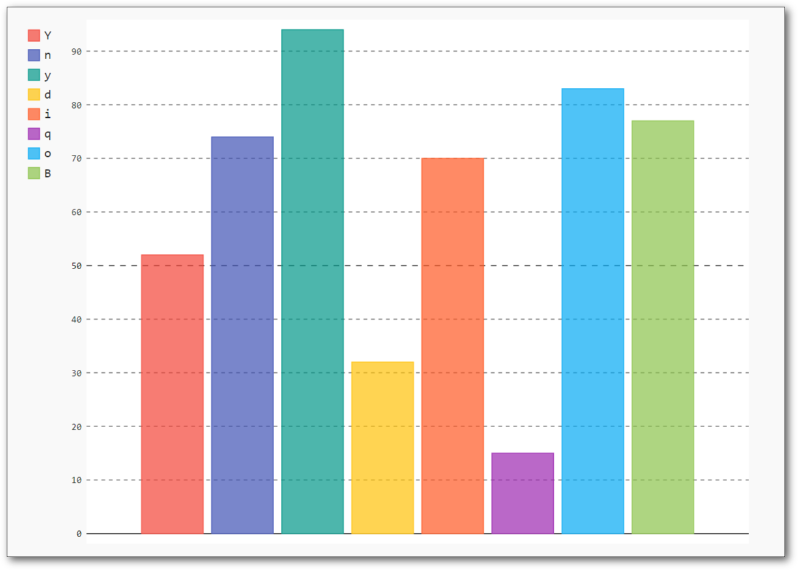

# Letterstat

Letterstat is a small python programm written to analyse the occurence of ASCII characters in a specific file. The results can be exported to a vector graphic (.svg).

## Installation

 1. Clone the project or download it as a .zip file
 2. Make sure you have installed  [python](https://www.python.org/downloads/)
 3. Install pygal if you haven't already  
 `pip install pygal`

## Usage

 -  Start your terminal in the project directory
 - To execute the program execute
  `python letterstat.py`
 - There are optional parameters:
	 - `-p <path to file>`
	 - `-s <graph size>`
	 - `-o <output filename>`

Example:

    python letterstat.py -p folder/file.txt -s 10 -o graph.svg

## Contributing
If you find an error feel free to submit an issue or pull request
